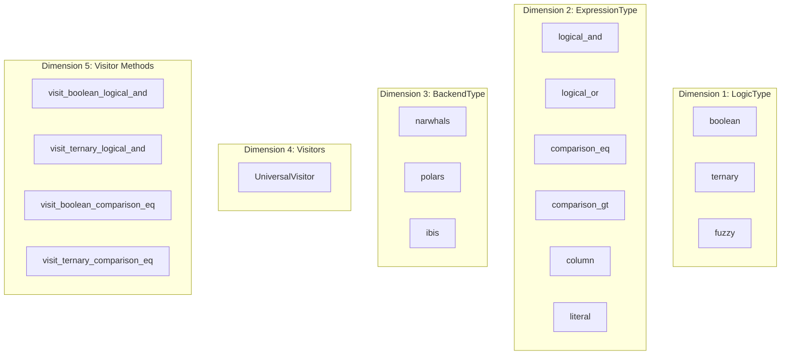
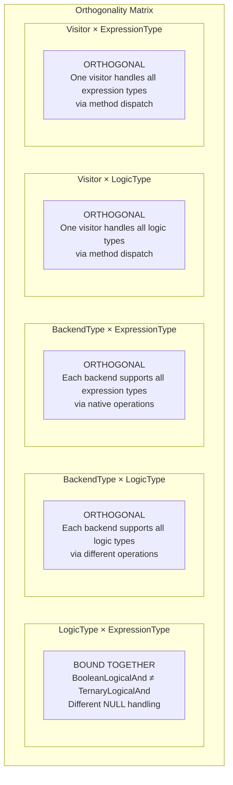
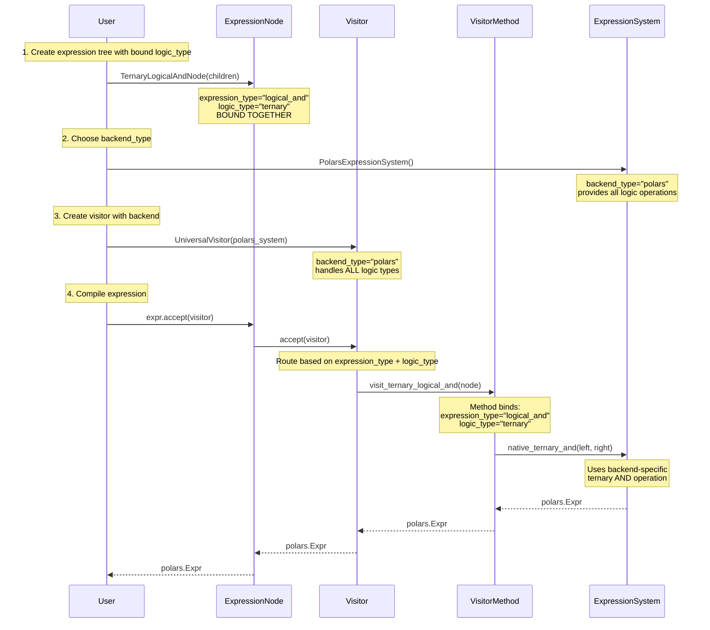
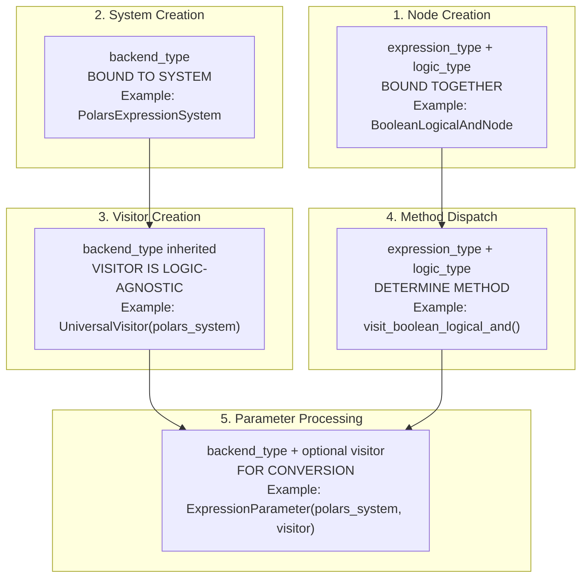

# Orthogonal Expression Architecture Diagram

## Core Dimensions Overview



## Component Binding Relationships

```mermaid
graph LR
    subgraph "ExpressionNode"
        EN[ExpressionNode<br/>BINDS: expression_type + logic_type]
        EN --> EN1[BooleanLogicalAndNode<br/>expression_type="logical_and"<br/>logic_type="boolean"]
        EN --> EN2[TernaryLogicalAndNode<br/>expression_type="logical_and"<br/>logic_type="ternary"]
        EN --> EN3[BooleanComparisonGtNode<br/>expression_type="comparison_gt"<br/>logic_type="boolean"]
        EN --> EN4[TernaryComparisonGtNode<br/>expression_type="comparison_gt"<br/>logic_type="ternary"]
    end
    
    subgraph "Visitor"
        V[UniversalVisitor<br/>BINDS: backend_type only]
        V --> V1[UniversalVisitor<br/>(NarwhalsExpressionSystem)]
        V --> V2[UniversalVisitor<br/>(PolarsExpressionSystem)]
        V --> V3[UniversalVisitor<br/>(IbisExpressionSystem)]
    end
    
    subgraph "VisitorMethods"
        VM[Visitor Methods<br/>BINDS: expression_type + logic_type]
        VM --> VM1[visit_boolean_logical_and<br/>handles: logical_and + boolean]
        VM --> VM2[visit_ternary_logical_and<br/>handles: logical_and + ternary]
        VM --> VM3[visit_boolean_comparison_gt<br/>handles: comparison_gt + boolean]
        VM --> VM4[visit_ternary_comparison_gt<br/>handles: comparison_gt + ternary]
    end
    
    subgraph "ExpressionSystem"
        ES[ExpressionSystem<br/>BINDS: backend_type only]
        ES --> ES1[NarwhalsExpressionSystem<br/>provides all logic operations]
        ES --> ES2[PolarsExpressionSystem<br/>provides all logic operations]
        ES --> ES3[IbisExpressionSystem<br/>provides all logic operations]
    end
    
    EN1 -.-> VM1
    EN2 -.-> VM2
    EN3 -.-> VM3
    EN4 -.-> VM4
    
    V1 --> ES1
    V2 --> ES2
    V3 --> ES3
```

## Orthogonal Relationship Matrix



## Compilation Flow Architecture



## Parameter Binding Points



## Component Matrix Summary

| Component | Required Parameters | Optional Parameters | Orthogonal To |
|-----------|-------------------|-------------------|---------------|
| **ExpressionNode** | `expression_type + logic_type` (bound) | - | `backend_type` only |
| **Visitor** | `backend_type` | - | `logic_type + expression_type` |
| **Visitor Method** | `expression_type + logic_type` (bound) | - | `backend_type` |
| **ExpressionSystem** | `backend_type` | - | `logic_type + expression_type` |
| **ExpressionParameter** | `backend_type` | `visitor` | `logic_type + expression_type` |

## Key Architectural Principles

### 1. Logic Type & Expression Type Are Bound
- `BooleanLogicalAndNode` ≠ `TernaryLogicalAndNode`
- Same operation, different NULL handling semantics
- Requires different visitor methods

### 2. Visitors Are Backend-Specific, Logic-Agnostic
- One `UniversalVisitor` per backend
- Handles ALL logic types via method dispatch
- No separate `BooleanVisitor`, `TernaryVisitor` per backend

### 3. Expression Systems Support All Logic Types
- Each backend provides both boolean and ternary operations
- No capability matrix needed
- Operations may delegate if not natively supported

### 4. Clean Parameter Separation
- Nodes: bind `expression_type + logic_type`
- Visitors: bind `backend_type` only
- Methods: dispatch on `expression_type + logic_type`
- Systems: provide operations for `backend_type`

This orthogonal architecture ensures:
- **Composability**: Any logic type works with any backend
- **Extensibility**: New backends or logic types don't break existing code
- **Type Safety**: Parameters bound at appropriate points
- **Performance**: No runtime type checking or complex dispatch